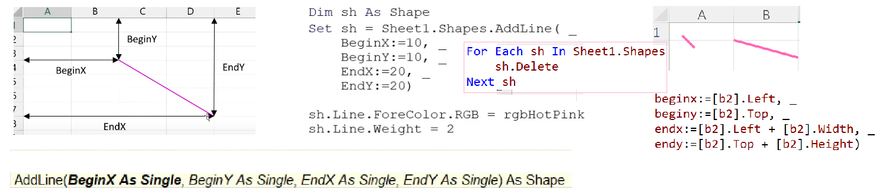
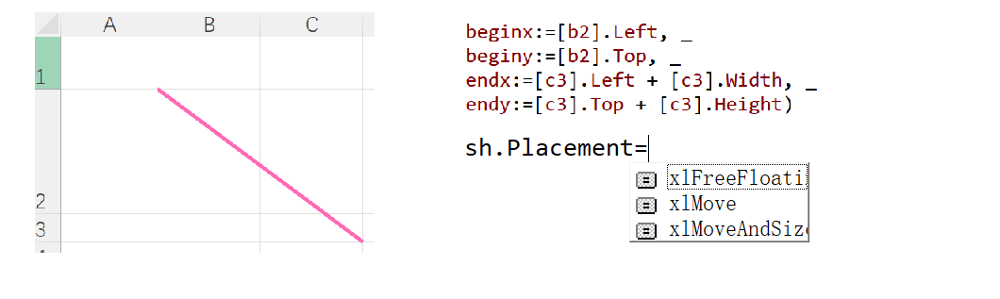
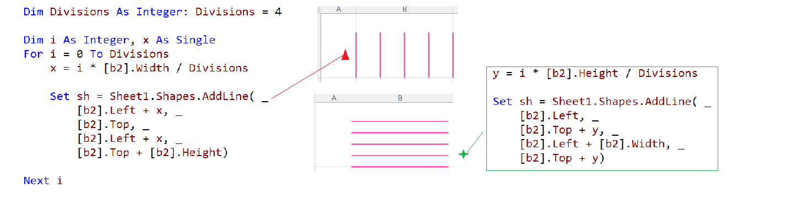
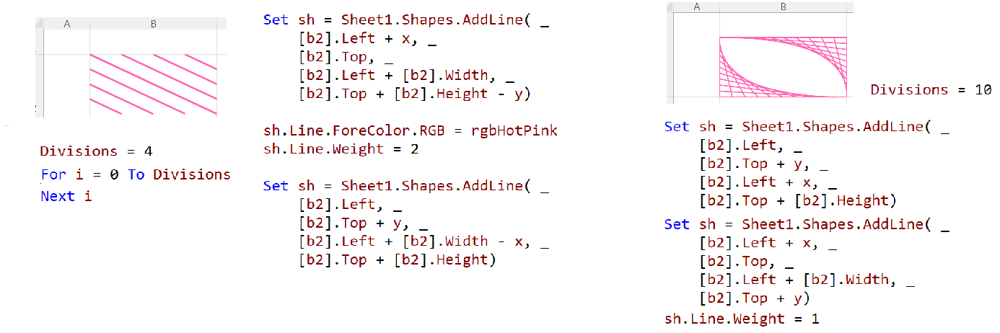

## How do I draw a line in a cell in Excel VBA

#### Draw a line & relative positioned

#### Across Multiple Cells

#### Drawing Multiple Lines at Intervals in a Cell

#### Dividing a Cell with Multiple Diagonal Lines

