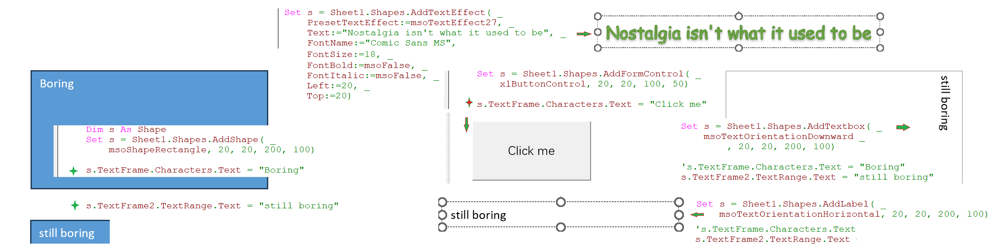
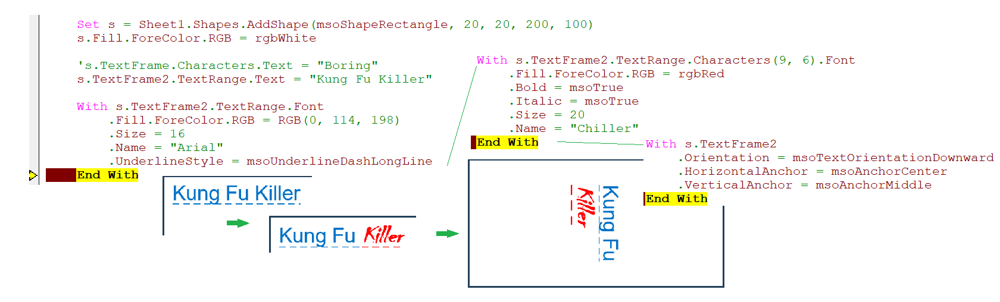
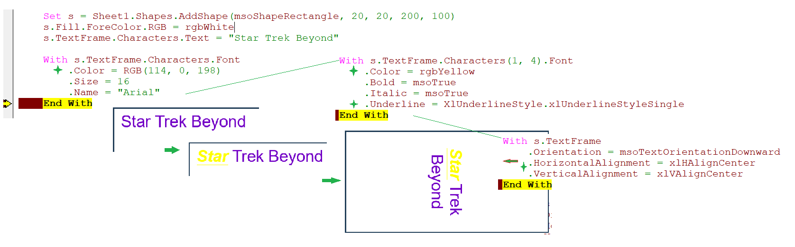
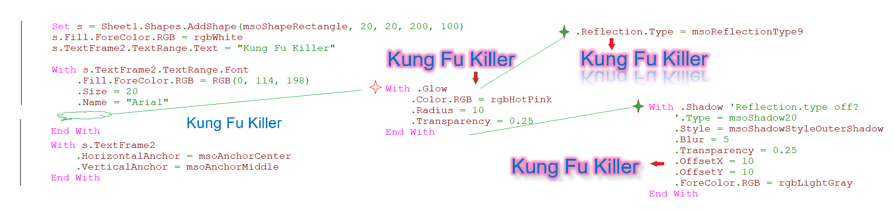

### Part 52.3 - Adding Text to Shapes

- Adding Basic Text to a Shape

  

- Formatting text in textframe2

  

- Formatting Text in textframe

  

- Glow, Reflection and Shadow Effects frame2 only

    

    

  

  

